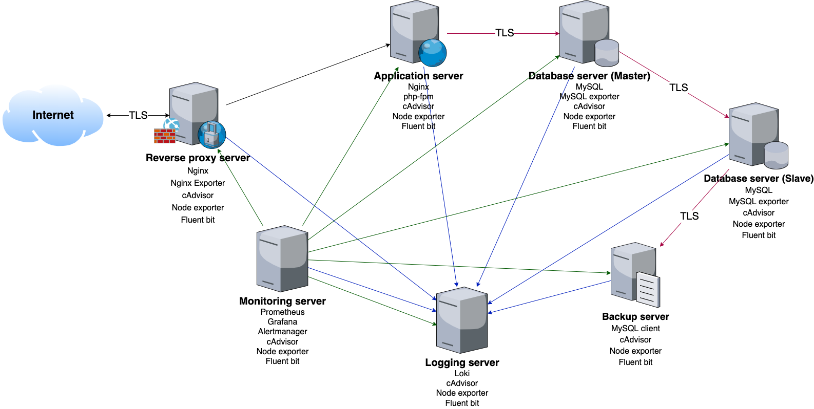
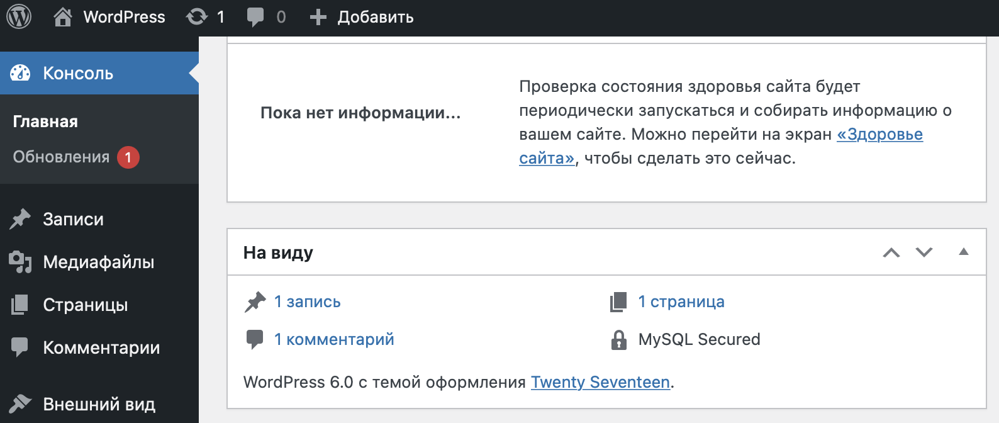
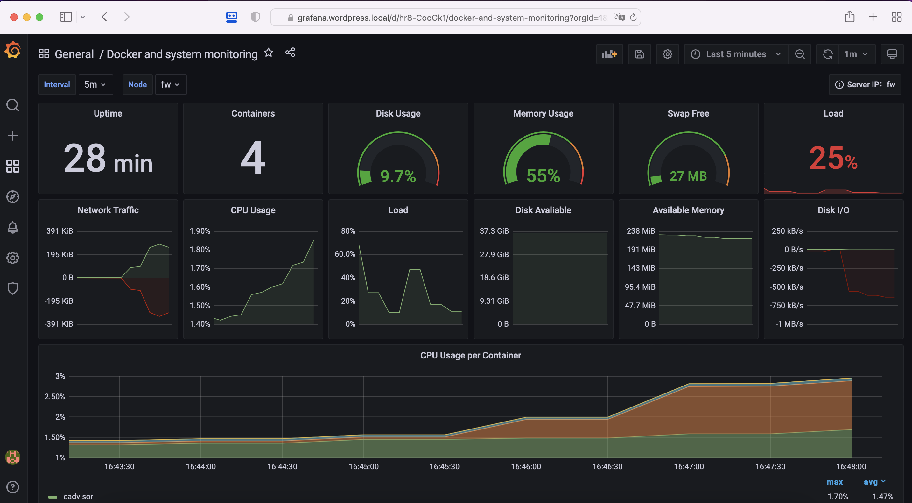

# Реализация инфраструктуры информационного Wеb-портала

## Архитектурная схема проекта



## Описание проекта

Особенности:

- Wordpress с автоконфигурированием
- docker контейнеры
- включен https
- основная инфраструктура в DMZ зоне
- фаерволл на входе
- сбор метрик и настроенный алертинг
- везде включен selinux
- организован централизованный сбор логов
- организована репликация базы данных
- организован бекап базы данных с реплики
- tls подключения к базе данных
- на реверс прокси включены gzip, cache, brotli

## Развертываемые компоненты

- Wordpress + autoconf
- Nginx + php-fpm
- MySQL
- Prometheus Stack
- Loki + fluent bit
- Docker + docker-compose
- Exporters

## Развертывание проекта

> Предварительно требуется создать файл **.ansible_vault_pass** с паролем от секрета в корне проект

### Подготовка виртуальных машин и раскатка плейбука

```bash
make
```

### Подготовка виртуальных машин

```bash
make deploy
```

### Раскатка плейбука

```bash
make provision
```

### Удаление виртуальных машин

```bash
make destroy
```

### Переключение реплики на мастер

```bash
make switchover
```

## Проверка работоспособности

- [Wordpress](https://wordpress.local)




- [Grafana](https://grafana.wordpress.local)



## Операции с секретами

```bash
ANSIBLE_VAULT_PASSWORD_FILE=./.ansible_vault_pass ansible-vault encrypt vars/vault.yml
ANSIBLE_VAULT_PASSWORD_FILE=./.ansible_vault_pass ansible-vault decrypt vars/vault.yml
```

## Нагрузочное тестирование

```bash
k6 run http_get.js --vus 1000 --duration 1m --insecure-skip-tls-verify
```
